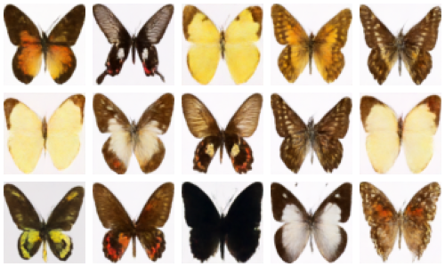
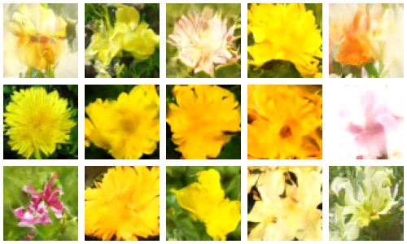

# DDPM
DDPM (Denoising Diffusion Probabilistic Models) implemented in PyTorch.

Based on the paper: https://arxiv.org/abs/2006.11239.

Inspired by the original implementation: https://github.com/hojonathanho/diffusion/tree/master and the PyTorch implementation by Phil Wang: https://github.com/lucidrains/denoising-diffusion-pytorch.

Trained on the following datasets:  
Smithsonian Butterflies subset: https://huggingface.co/datasets/huggan/smithsonian_butterflies_subset  
Oxford Flowers 102: https://www.robots.ox.ac.uk/~vgg/data/flowers/102/

## Results
### Settings
epochs: 1600  
batch size: 32  
image size: 64  
learning rate: 8e-5  
loss function: Huber loss  
optimizer: Adam (default values)  
group normalization groups: 8  
beta_1: 0.0001  
beta_T: 0.02  
timesteps: 1000  

### Results
#### Smithsonian Butterflies  
Epoch 1600             |  Denoising Process
:-------------------------:|:-------------------------:
  |  

#### Oxford Flowers 102  
Epoch 1600             |  Denoising Process
:-------------------------:|:-------------------------:
  |  
