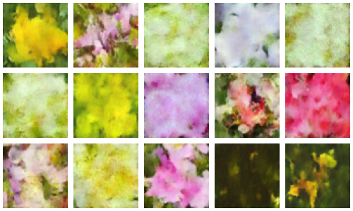

# DDPM
DDPM (Denoising Diffusion Probabilistic Models) implemented in PyTorch.

Based on the paper: https://arxiv.org/abs/2006.11239.

Inspired by the original implementation: https://github.com/hojonathanho/diffusion/tree/master and the pytorch implementation by Phil Wang: https://github.com/lucidrains/denoising-diffusion-pytorch.

Trained on the Flowers102 dataset: https://www.robots.ox.ac.uk/~vgg/data/flowers/102/.

## Results
### Settings
epochs: 200
group norm groups: 8
beta_1: 0.0001
beta_T: 0.02
timesteps: 1000
learning rate: 0.0002
loss function: Huber loss
optimizer: Adam (default values)

### Experiments
Image size 64 and batch size 64.  

### Experiment 2
Image size 128 and batch size 32.  

| Experiment 1 image size: 64x64 batch size: 64 | Experiment 2 image size: 128x128 batch size: 32 |
|--------------------------|--------------------------|
| image size: 64x64 batch size: 64 | image size: 128x128 batch size: 32 |

|  |  |
